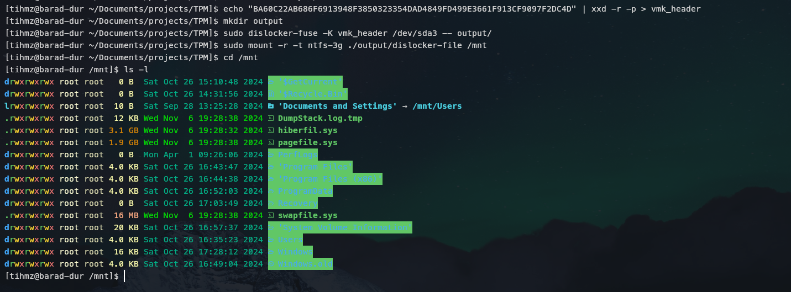

# Bypassing bitlocker with TPM sniffing

Using a TPM sniffing attack, I was able to bypass bitlocker encryption on a Thinkpad X380 Yoga

## The victim

For this attack, I used my personal laptop, a [Thinkpad X380 Yoga](https://www.lenovo.com/us/en/p/laptops/thinkpad/thinkpadx/thinkpad-x380-yoga/22tp2txx380). It's a kind of tablet-laptop computer, with an integrated discrete Trusted Platform Module (dTPM). 
So of course *I had* to open it and try bypassing the TPM encryption.

## Finding the TPM

This laptop is very easy to disassemble (in my opinion), because the keyboard/touchpad is plugged on the same side as the battery and everything else, so you don't have to remove the keyboard (like for other thinkpad).

Once I removed the motherboard (MB) completly, I examined every chip that could ne a TPM, and one the backside of the MB, I found it :


The chip is a **P68HAHB4**, from STMicroelectronics.

With a quick google search, I found the documentation for this exact chip in [this document](https://csrc.nist.gov/CSRC/media/projects/cryptographic-module-validation-program/documents/security-policies/140sp3302.pdf) :


One problem I encountered is that the same model of this chip (VQFN32) can be found with SPI or I²C configuration (see the datasheet). So by looking at the pin used on my laptop, I deduced that I was looking at the chip with SPI configuration :


Which, translated to the chip on my laptop, would give :


## Soldering time

As stated before, this chip use the SPI (Serial Peripheral Interface) to communicate with the CPU and transfer information (like a bitlocker key for example).

To communicate/sniff SPI, I need at least 5 wires :
- GND (of course)
- CLK, the clock line
- CS (Chip Select), needed to know when to read data
- MISO (Master In Slave Out), data line #1
- MOSI (Master Out Slave In), data line #2

SPI use a master-slave architecture, here the slave is the TPM chip and the master is the CPU.

I don't remember how much the photo of the chip is zoomed, but let me tell you it's **very small**. I used copper wire of 0.1mm to be sure I don't damage the circuit of the computer (I need it to work at school). For thoses who care I used a Weller 1010 with the smallest tip I could find.

After a lot of patience to make sure I don't nuke my computer, I got this :

| The soldering     | The "Security"    |
| ----------------- | ----------------- |
|  |  |
(I put a lot of tape to avoid pulling on the wire and ripping the circuit)

After that I soldered some colored wire with female connectors to be able to access the wires while the motherboard is mounted :


## Time to Sniff !

Now come the funny part : plugging the logic analyser and trying to decode the communication.

>[!NOTE]
>I first tried to use microcontrollers (ESP32, Arduino, Raspberry Pico) with existing code but none worked. I'll try to add an ESP32 code later (if I have the time).

To sniff the traffic, I used a [Kingst LA2015](https://sigrok.org/wiki/Kingst_LA2016#Protocol) because this is the cheapest high-speed logic analyser I found on amazon. (I wanted at least 100MHz of sampling).

The "bad" thing is that this kind of analyser seems to only work with the KingstVIS software, and not with the one I already knew like PulseView or Logic2.

But let's put that aside for now, it's time to sniff :


(I got the GND wire from a USB cable, to avoid destroying my computer even more).

Once everything is plugged in, I launched the super KingstVIS software and started sampling, before powering up the computer :


To be honest, I actually was able to have it working in stream mode with only 50Mhz of sampling.

## Decoding the SPI

Now that I have some data, I need to find way to decode it.
KingstVIS has a built-in SPI decoder, but I wanted to use the decoder described in [this blog](https://lucasteske.dev/2024/01/tpm2-bitlocker-keys)
As it only work in PulseView (for now...), I exported the data from KingstVIS to a CSV file to import it in PulseView.

By the way KingstVIS add a timestamp column, and it doesn't look like PulseView accept this, so you can remove it with :
```shell
sed -i 's/^[^,]*, //' tpm_export.csv  # remove the first column of a CSV
```

To add a custom decoder, create a new folder in one of the directory used by PulseView:
```
/home/$USER/.local/share/libsigrokdecode/decoders
/usr/share/libsigrokdecode/decoders
/usr/share/libsigrokdecode/decoders
```

Then create a new folder named `tpmdecoder`, and add the 2 python files of this repo :
```shell
$ tree ~/.local/share/libsigrokdecode/
libsigrokdecode/
└── decoders.
    └── tpmdecoder/
        ├── __init__.py
        └── pd.py
```

Once the custom TPM decoder has been added, you can add a SPI decoder (let all parameter by default, only assign the right data line, and set `CS# polarity` to `active-low`) and select "TPM2.0" in the stack decoder option :


And I got this :


Look like it worked... so what now ? Is it over ? Well, almost.

I needed to validate that the key was the right one, and to do that, I need to access the drive by unlocking him using the key. This can be done very easily using the tool `dislocker`:
```shell
echo "<your_key>" | xxd -r -p > vmk_header
mkdir output
sudo dislocker-fuse -K vmk_header /dev/sda3 -- output/
sudo mount -r -t ntfs-3g ./output/dislocker-file /mnt
```



And like that, I can access the content of the drive.

>[!NOTE]
>I mounted the drive read only `-r` to avoid damages as the computer use hibernation mode. If you want to backdoor the drive or anything else that requiert to write on it, you can follow the advices [given here](https://askubuntu.com/questions/145902/unable-to-mount-windows-ntfs-filesystem-due-to-hibernation).

## References

- https://github.com/NoobieDog/TPM-Sniffing
- https://csrc.nist.gov/CSRC/media/projects/cryptographic-module-validation-program/documents/security-policies/140sp3302.pdf
- https://lucasteske.dev/2024/01/tpm2-bitlocker-keys
- https://github.com/Aorimn/dislocker/
- https://askubuntu.com/questions/145902/unable-to-mount-windows-ntfs-filesystem-due-to-hibernation
